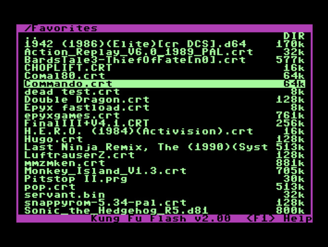
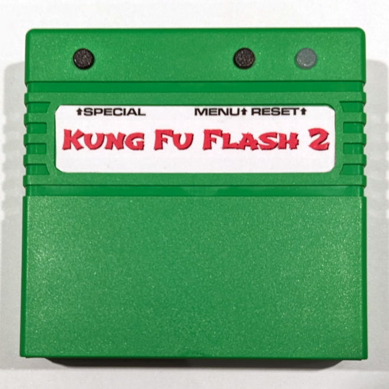
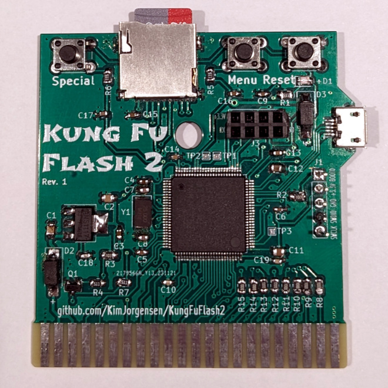

# Kung Fu Flash 2

Cartridge for the Commodore 64 that packs a punch.

Kung Fu Flash 2 is the big brother of [Kung Fu Flash](https://github.com/KimJorgensen/KungFuFlash). It has a faster microcontroller with more memory and I/O pins, allowing for additional functionality.

**Currently, this project is considered experimental** and provides the same features as Kung Fu Flash, with these notable exceptions:

* CRT files are loaded into RAM, not flash, making large CRT files startup faster. However, changes to EasyFlash cartridges are lost if power is turned off, unless saved via the menu first
* The cartridge detects if the C64/C128 is reset. This allows the use of an additional reset button on the C64 or the built-in reset button on the C128
* REU emulation has been added

Kung Fu Flash 2 can emulate different cartridge types, load PRG files and use D64 disk images.
Just place your desired CRT, PRG or D64 files on a FAT formatted microSD card and use the built-in launcher to execute them.

## Hardware

There are three buttons on the cartridge; a reset button, a menu button for starting the launcher, and a special button that is used by the freezer cartridges.

The form factor is similar to Kung Fu Flash and it should be possible to use the same cartridge cases.
It could be the Stumpy Cartridge Case from TFW8b or the 3D printed cartridge case designed by bigby, [see here](https://www.thingiverse.com/thing:4153414).

The gerber files and BOM can be found [here](https://github.com/KimJorgensen/KungFuFlash2/releases/tag/v2.00).

## Supported Cartridges

The following cartridge types are currently supported:

* Generic cartridge (8k, 16k, Ultimax)
* Action Replay v4.x/v5/v6
* KCS Power Cartridge
* Final Cartridge III(+)
* Simons' BASIC
* Fun Play, Power Play
* Super Games
* Ocean type 1
* Epyx Fastload
* C64 Game System, System 3
* WarpSpeed
* Dinamic
* Zaxxon, Super Zaxxon
* Magic Desk, Domark, HES Australia
* Super Snapshot v5
* Comal-80
* EasyFlash
* Prophet64
* Freeze Frame
* Freeze Machine
* Pagefox
* RGCD, Hucky
* Drean
* C128 Generic cartridge (external function ROM)
* WarpSpeed 128

## Supported File Types

The following file types are currently supported:

* Cartridge (CRT)
* C64/C128 generic cartridge (ROM, BIN)
* Disk image (D64, D71, D81)
* Tape image (T64)
* Program (PRG, P00)
* Firmware update (UPD)
* Text document (TXT, NFO, 1ST)

## REU Emulation

Kung Fu Flash 2 can emulate a 1 Mb REU (RAM Expansion Unit) simultaneously with disk drive emulation.
The REU is enabled in the settings menu (F5) and active when:

* A program is executed using the default option (RETURN)
* A disk image or directory is mounted using "Mount" in the file options menu (SHIFT+RETURN)
* BASIC is started via F6 (C128) or F7 (C64) in the launcher

The REU will not be active when emulating cartridges (CRT files)

## USB Port

The USB port allows programs or disk images to be transferred from/to a PC using the EasyFlash 3 USB protocol.
The USB port is active when:

* The Kung Fu Flash 2 launcher is running
* A program is started using "Load" in the file options menu (SHIFT+RETURN)
* BASIC is started via F7 in the launcher **and** REU emulation is disabled in the settings menu (F5)

Kung Fu Flash 2 shows up as a standard serial port when connected to a PC not requiring any custom drivers to be installed.
This means, however, that the EasyFlash 3 program on the PC side must be modified to support Kung Fu Flash.

The repository of the original Kung Fu Flash contains a modified version of [EasyFlash 3 USB Utilities](https://github.com/KimJorgensen/KungFuFlash/tree/master/3rd_party/ef3utils)
and [EasyFlash 3 BBS](https://github.com/KimJorgensen/KungFuFlash/tree/master/3rd_party/ef3bbs) which will also work with the Kung Fu Flash 2.

## Firmware Update

Just place the KungFuFlash_v2.xx.upd file on the SD card and select the file in the launcher to initiate the firmware update.
The newest firmware can be found [here](https://github.com/KimJorgensen/KungFuFlash2/releases/).

For initial firmware installation, [see here](firmware/README.md).

## Limitations

Kung Fu Flash 2 is a so called Software Defined Cartridge where a fast microcontroller emulates cartridge hardware in software.
This makes it extremely flexible, allowing different cartridge types to be supported at a relative low cost.

However, it can be challenging to get the C64 bus timing correct in software and in some places the timing is very close to the limit.
Even though Kung Fu Flash 2 has been tested on different models of the Commodore 64, there is a chance that it doesn't work correctly on your specific model, or requires [phi2 offset adjustment](firmware/README.md#diagnostic).
Use it at your own risk!

Kung Fu Flash 2 will work with the PAL and NTSC version of the Commodore 64 or Commodore 128.

Disk drive emulation is using kernal vectors and will not work with fast loaders or software that uses direct hardware access which a lot of games does.
Currently REL files are not supported and only a subset of the Commodore DOS commands are supported.

## Thanks

Kung Fu Flash 2 was based on or uses other open source projects:

* [Kung Fu Flash](https://github.com/KimJorgensen/KungFuFlash)
* [EasyFlash 3](https://bitbucket.org/skoe/easyflash) by Thomas Giesel
* [Draco Browser](https://csdb.dk/release/?id=89910) by Sascha Bader
* [fatfs-stm32](https://github.com/colosimo/fatfs-stm32) by Aurelio Colosimo
* [FatFs](http://elm-chan.org/fsw/ff/00index_e.html) by ChaN
* [libusb_stm32](https://github.com/dmitrystu/libusb_stm32) by Dmitry Filimonchuk
* [OpenC64Cart](https://github.com/SukkoPera/OpenC64Cart) by Giorgioggì
* [Disk2easyflash](https://csdb.dk/release/?id=150323) by ALeX Kazik

and a few others. Please check the individual files for their license.
